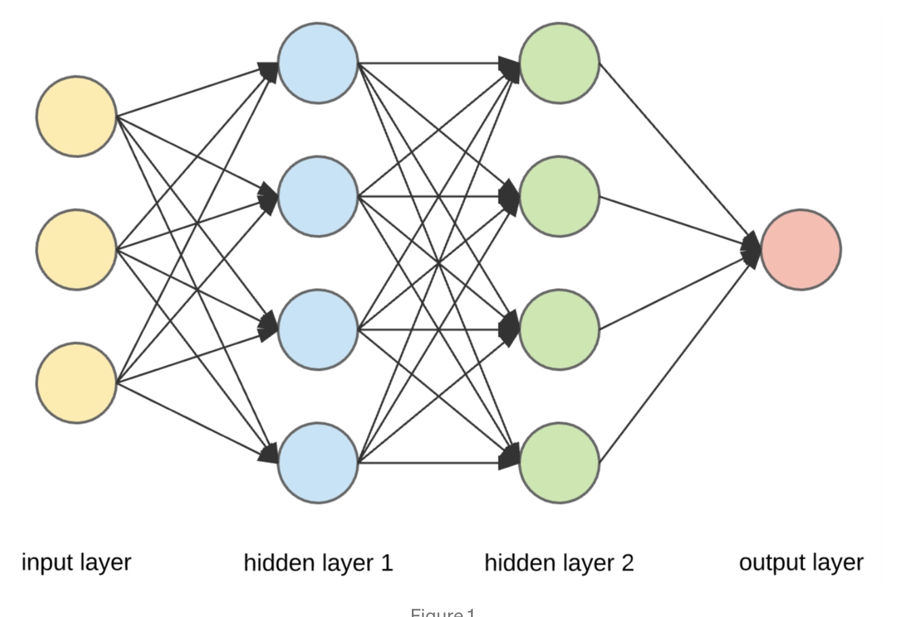
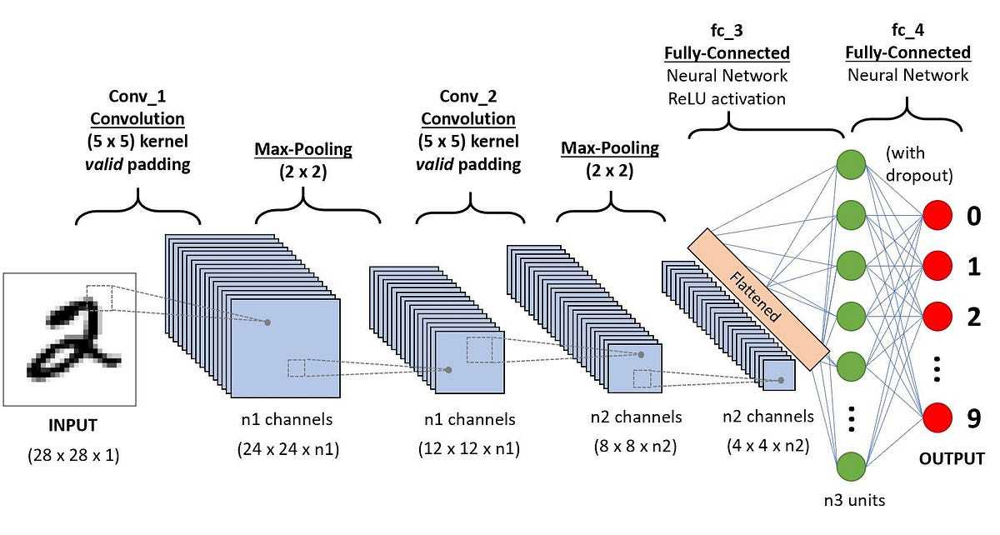
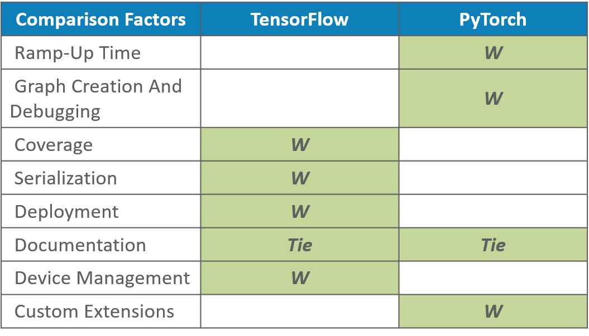

# Neural Networks and Deep Learning - Chapter 1 Summary

## Overview

In this chapter, the core principles of neural networks are introduced by exploring how they can be applied to the task of recognizing handwritten digits (0-9). The chapter demonstrates the architecture of a simple neural network and its training process using a learning algorithm called **stochastic gradient descent (SGD)**.

### Key Concepts

1. **Perceptrons**:
   - A perceptron is the simplest type of neural network unit. It performs binary classification by summing up input values, applying weights, and determining the output via an activation function (e.g., step function).

2. **Neural Networks**:
   - A neural network is a collection of neurons (or perceptrons) organized in layers. It consists of:
     - **Input Layer**: Receives input features (e.g., pixel values from an image).
     - **Hidden Layer(s)**: Performs intermediate processing and transformations.
     - **Output Layer**: Produces the final predictions or classifications.
  
3. **Activation Function**:
   - Instead of using a step function as in perceptrons, modern neural networks typically use the **sigmoid function**, which outputs a continuous value between 0 and 1. This smooths the transitions between outputs and helps with gradient-based learning.

4. **Cost Function**:
   - The **quadratic cost function** is used to measure how well the neural network's predictions match the actual outputs. The goal is to minimize this cost during training by adjusting the weights.

5. **Backpropagation and Gradient Descent**:
   - **Backpropagation** is a key algorithm used to compute gradients of the cost function with respect to each weight in the network.
   - **Gradient Descent** is used to iteratively adjust the weights in a direction that minimizes the cost function, effectively teaching the neural network.

6. **Stochastic Gradient Descent (SGD)**:
   - SGD is a variant of gradient descent where the model is updated on small batches of data (instead of the entire dataset). This makes the training process faster and more efficient.

### Handwritten Digit Recognition

The chapter illustrates the process of using neural networks to recognize handwritten digits from the **MNIST dataset**, a famous dataset containing 28x28 pixel grayscale images of digits.

- The network architecture consists of an input layer with 784 neurons (one for each pixel), a hidden layer with adjustable neuron count, and an output layer with 10 neurons (one for each possible digit).
- During training, the network learns to associate the input image pixels with the correct digit through backpropagation and stochastic gradient descent.
  

### Challenges and Limitations

The chapter also highlights some challenges with basic neural networks:
- **Slow training convergence**: Due to poor initialization of weights or slow learning algorithms.
- **Overfitting**: The model may perform well on training data but poorly on unseen test data.
- **Complex datasets**: More advanced architectures are needed for tasks with larger or more complex datasets.

  

### Future Directions

Later chapters expand on these ideas and introduce more advanced techniques to improve the performance of neural networks, such as better weight initialization, regularization, and more sophisticated training algorithms.

# Comparison of Implementation between PyTorch and TensorFlow

The handwritten digit classification neural network developed in this project from scratch used both the PyTorch and TensorFlow frameworks. This is followed by a comparison done next in terms of ease of use, performance, and flexibility.

## 1. Ease of Use

### **PyTorch:**
Dynamic Computation Graph: PyTorch features a dynamic computation graph. What this means is that it builds up the graph at runtime during activities. More intuitive, debugging is easier, tests too, especially for people just starting to work with this library.
• Pythonic Syntax: PyTorch syntax is much more "Python-like." That is why, right from the very beginning, I immediately felt that working with PyTorch wasn't different than working with any other Python library. This should in fact help make things easier for a Python developer at work.
- **Clear Debugging**: PyTorch, since it builds the computation graph dynamically, can use traditional debugging like `pdb`, and hence is capable of step-by-step execution for debugging.
- **Docmentation**: PyTorch's documentation is easy to read and accessible by any beginner.
Static Computation Graph: TensorFlow used to default to using static computation graphs, which felt counterintuitive. However, in TensorFlow 2.x, **Eager Execution** was introduced, which should make TensorFlow much more Dynamic - similar to PyTorch, though the syntax is often more complicated.
Keras API: Featured in TensorFlow 2.x is the high-level Keras API, providing an abstract interface to implement and use models. With Keras, it is more friendly for those users who need high-level abstractions. Verbose: Compared to PyTorch, TensorFlow is a bit more verbose. It is OK, but does bring in a little extra boilerplate on some of the use cases.
            **PyTorch is more friendly to a beginner.**

## 2. Performance

### PyTorch:
Training Speed: With several recent optimizations, PyTorch is competitive in speed with TensorFlow. It is doing extremely well on small research-oriented projects where flexibility can be an advantage but is maybe somewhat comparable, or a little slower for large-scale applications.
- **GPU Acceleration**: PyTorch natively supports CUDA for seamless acceleration on a GPU. PyTorch uses GPUs well during deep learning tasks. The performance will vary depending on the hardware and with the particular task in consideration.

### **TensorFlow:**
- **Production Optimized**: TensorFlow is designed keeping large-scale production deployment in mind and hence much optimized for performance both for training as well as for inference, especially in a distributed computing environment.
- **XLA Compiler:** TensorFlow was based on an XLA or Accelerated Linear Algebra compiler; because of this, the execution speed of the models will be optimal and hence an edge for certain large-scale applications.
- **TPU Support**: TensorFlow natively supports Google's TPUs-Tensor Processing Units, which really amped up the performance when dealing with large-scale distributed training tasks.

**Generally, TensorFlow is better than PyTorch on large-scale and production environments - particularly when one is doing distributed computing or on TPUs. However, PyTorch remains somewhat competitive in many of the research-oriented tasks.**

## 3. Flexibility

### PyTorch:
Dynamic Graph: PyTorch's dynamic graph is unparalleled when it comes to flexibility for research experimentation. You should have been able to change the computation graph even at runtime, which makes it easier to implement those complex models that might have variable layers or time steps.
 Model Customization: The modeling of custom models in PyTorch can be as simple as your object-oriented design needs; you could just subclass `torch.nn.Module`.
- **Research-Focused:** PyTorch is very popular in the research community since one can prototype easily and also debug it.

### **TensorFlow:**
- **Ecosystem**: TensorFlow has a huge, well-developed ecosystem filled with tools for nearly each phase of the ML lifecycle. It has TensorFlow Lite-for mobile/embedded, TensorFlow Serving-to deploy, and TensorFlow Extended for data pipelines. It's an all-in-one framework since it covers training, deployment, and scaling.
**TensorFlow Hub and Model Zoo**: TensorFlow has pre-trained models and modules that can easily be used for transfer learning; it's flexible for both research and production.
**Static and Dynamic Graphs**: With Eager Execution, TensorFlow also allows dynamic graph computation as PyTorch does. However, the transition from eager mode to static mode or vice-versa in real applications may require extra work.

**Basically, in PyTorch, through dynamic graph it allows flexibility regarding research or experimental purposes. On the other hand, TensorFlow yields a higher flexibility in terms of deployment and production-ready tools.**

